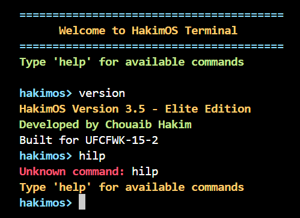

# 🖥️ HakimOS - Second Year Operating System Project

<div align="center">


**A custom 32-bit operating system kernel built from scratch**

*University Project - Second Year Computer Science*

</div>

---

## 📖 About This Project

This is my second-year university operating systems project where I built a **minimal 32-bit operating system kernel from scratch**. The project demonstrates fundamental OS concepts including:

- ✅ **Bootloader Integration** - GRUB Multiboot-compliant kernel loading
- ✅ **Low-Level Programming** - x86 Assembly and C integration
- ✅ **Hardware Drivers** - VGA framebuffer driver for text output
- ✅ **Interrupt Handling** - PIC configuration and keyboard interrupts
- ✅ **Terminal Interface** - Interactive command-line shell with multiple features
- ✅ **Memory Management** - Stack setup and linker script configuration

The operating system runs in QEMU and features a fully functional terminal with command processing, command history, tab completion, and even a simulated file system!

---

## 🎯 Project Structure

The project is divided into two main parts:

| Part | Description | Key Features |
|------|-------------|--------------|
| **[Part 1](./part1/)** | Minimal Bootable Kernel | Multiboot header, assembly-to-C interface, VGA framebuffer driver |
| **[Part 2](./part2/)** | Interactive Terminal | Keyboard input, interrupt handling, command processor, extensions |

```
HakimOS/
├── README.md                    # This file
├── part1/                       # Minimal bootable kernel
│   ├── drivers/                 # Framebuffer driver
│   ├── source/                  # Kernel source code
│   ├── iso/                     # GRUB boot files
│   └── Makefile
└── part2/                       # Interactive terminal
    ├── drivers/                 # All hardware drivers
    │   ├── frame_buffer.*       # VGA text mode driver
    │   ├── keyboard.*           # PS/2 keyboard driver
    │   ├── interrupts.*         # IDT and interrupt handlers
    │   ├── pic.*                # Programmable Interrupt Controller
    │   └── input_buffer.*       # Circular buffer for input
    ├── source/                  # Kernel and terminal code
    │   ├── terminal.*           # Command-line interface
    │   └── kmain.c              # Kernel entry point
    ├── iso/                     # GRUB boot files
    └── Makefile
```

---

## ⚙️ Prerequisites & Environment Setup

Since this project was originally developed on a Linux environment (CSCT Cloud), you'll need to set up the required tools on your system.

### 🐧 For Linux (Ubuntu/Debian)

```bash
# Update package list
sudo apt update

# Install essential build tools
sudo apt install build-essential

# Install NASM assembler (for x86 assembly)
sudo apt install nasm

# Install QEMU emulator (to run the OS)
sudo apt install qemu-system-i386

# Install genisoimage (to create bootable ISO)
sudo apt install genisoimage

# Install GRUB tools (optional, for stage2_eltorito)
sudo apt install grub-pc-bin

# Install telnet (for QEMU monitor control)
sudo apt install telnet
```

### 🍎 For macOS

```bash
# Install Homebrew if not already installed
/bin/bash -c "$(curl -fsSL https://raw.githubusercontent.com/Homebrew/install/HEAD/install.sh)"

# Install required tools
brew install nasm
brew install qemu
brew install cdrtools  # Provides mkisofs (alternative to genisoimage)
brew install i686-elf-gcc  # Cross-compiler for 32-bit ELF
```

> **Note for macOS:** You may need to use `mkisofs` instead of `genisoimage` and adjust the Makefile accordingly.

### 🪟 For Windows (Using WSL2 - Recommended)

1. **Install WSL2:**
   ```powershell
   # In PowerShell as Administrator
   wsl --install -d Ubuntu
   ```

2. **After WSL restarts, open Ubuntu and run:**
   ```bash
   sudo apt update
   sudo apt install build-essential nasm qemu-system-i386 genisoimage telnet
   ```

3. **Clone and run the project inside WSL:**
   ```bash
   cd /mnt/c/path/to/project
   ```

### 🐳 Using Docker (Alternative - Any OS)

If you prefer Docker, you can use a pre-configured OS development environment:

```bash
# Pull a suitable Docker image
docker pull randomdude/gcc-cross-x86_64-elf

# Run with your project mounted
docker run -it -v $(pwd):/src randomdude/gcc-cross-x86_64-elf /bin/bash
```

---

## 🚀 How to Build and Run

### Part 1: Minimal Kernel with Framebuffer

```bash
# Navigate to part1 directory
cd part1

# Clean previous builds
make clean

# Build the kernel and create ISO
make all

# Run in QEMU
make run
```

**To exit QEMU:**
```bash
# In another terminal
telnet localhost 45454
# Then type: quit
```

### Part 2: Interactive Terminal

```bash
# Navigate to part2 directory
cd part2

# Clean previous builds
make clean

# Build everything
make all

# Create bootable ISO
make os.iso

# Run in QEMU with curses display
make run-curses
```

**To exit QEMU:**
```bash
# In another terminal
telnet localhost 55454
# Then type: quit
```

---

## 🎮 Terminal Commands (Part 2)

Once the OS boots in Part 2, you'll see the `hakimos>` prompt. Available commands:

| Command | Description |
|---------|-------------|
| `help` | Display all available commands |
| `echo <text>` | Print text to screen |
| `clear` | Clear the screen |
| `version` | Show OS version information |
| `ls` | List files in virtual file system |
| `cat <file>` | Display file contents |
| `pwd` | Print current working directory |
| `shutdown` | Prepare system for shutdown |

### Special Features

- **⬆️⬇️ Arrow Keys**: Browse command history
- **Tab Key**: Auto-complete commands
- **Colored Output**: Different colors for prompts, errors, and info

---

## 🔧 Technical Details

### Memory Layout
- **Kernel loaded at:** 0x00100000 (1MB mark)
- **Stack size:** 4KB
- **VGA framebuffer:** 0x000B8000

### Interrupt Configuration
- **IRQ1 (Keyboard):** Mapped to interrupt vector 33
- **PIC1 base:** 0x20
- **PIC2 base:** 0x28

### Build Tools Required
| Tool | Purpose | Version Used |
|------|---------|--------------|
| GCC | C compiler (32-bit mode) | 9.x+ |
| NASM | x86 assembler | 2.14+ |
| LD | GNU linker | 2.34+ |
| QEMU | x86 system emulator | 4.2+ |
| genisoimage | ISO creation tool | 1.1.11+ |

---

## 📸 Screenshots

### Part 1: Framebuffer Output
The kernel boots and displays colored text output demonstrating the VGA framebuffer driver:


### Part 2: Interactive Terminal
Full terminal interface with command processing:



---

## 📚 What I Learned

Through this project, I gained hands-on experience with:

1. **x86 Architecture** - Understanding the boot process, protected mode, and CPU registers
2. **Assembly Programming** - Writing bootloader code and interrupt handlers
3. **C/Assembly Integration** - Calling conventions and stack management
4. **Hardware Programming** - Direct port I/O for keyboard and display
5. **Interrupt Handling** - Configuring the PIC and writing ISRs
6. **Kernel Development** - Memory layout, linker scripts, and freestanding C

---

## 🤝 Acknowledgments

- University module: UFCFWK-15-2 Operating Systems
- [OSDev Wiki](https://wiki.osdev.org/) - Invaluable resource for OS development
- [The Little OS Book](https://littleosbook.github.io/) - Great tutorial for beginners

---

## 📄 License

This project was created for educational purposes as part of my university coursework. Feel free to use it as a reference for learning about operating system development.

---

<div align="center">

**⭐ If you found this project helpful, please give it a star! ⭐**

Made with ❤️ by Chouaib Hakim

</div>
