# 🖥️ HakimOS - Part 2: Interactive Terminal with Keyboard Input

<div align="center">


**A fully functional command-line interface built from scratch**

</div>

---

**Author:** Chouaib Hakim  
**Project:** Second Year Operating Systems Project  
**Part:** 2 of 2 - Interactive Terminal with Keyboard Input

---

## 📖 Overview

This is Part 2 of my operating systems project where I built an **interactive terminal interface with keyboard input handling**. The project demonstrates:

- ✅ Circular input buffer for efficient keyboard input storage
- ✅ Complete command processor with multiple built-in commands
- ✅ Hardware interrupt handling (PIC configuration, IDT setup)
- ✅ PS/2 keyboard driver with scan code translation
- ✅ **Extensions:** Command history, tab completion, color support, and a simulated virtual file system

---

## 📑 Table of Contents
- [Prerequisites & Setup](#-prerequisites--setup)
- [Repository Structure](#repository-structure)
- [How to Build and Run](#how-to-build-and-run)
- [Available Commands](#-available-commands)
- [Part 1: Display Keyboard Input](#part-1-display-keyboard-input)
- [Part 2: Input Buffer API](#part-2-input-buffer-api)
- [Part 3: Terminal Implementation](#part-3-terminal-implementation)
- [Extension 1: Command History](#extension-1-command-history)
- [Extension 2: Tab Completion](#extension-2-tab-completion)
- [Extension 3: Color Support](#extension-3-color-support)
- [Extension 4: Virtual File System](#extension-4-virtual-file-system)

---

## ⚙️ Prerequisites & Setup

Before building and running this project, you need to install the required development tools.

### 🐧 Linux (Ubuntu/Debian)

```bash
# Update packages and install all required tools
sudo apt update
sudo apt install build-essential nasm qemu-system-i386 genisoimage telnet
```

### 🍎 macOS

```bash
# Using Homebrew
brew install nasm qemu cdrtools i686-elf-gcc
```

### 🪟 Windows (Using WSL2 - Recommended)

1. Install WSL2 with Ubuntu:
   ```powershell
   wsl --install -d Ubuntu
   ```

2. Inside Ubuntu terminal:
   ```bash
   sudo apt update
   sudo apt install build-essential nasm qemu-system-i386 genisoimage telnet
   ```

### Required Tools Summary

| Tool | Purpose | Installation Check |
|------|---------|-------------------|
| `gcc` | C compiler (32-bit) | `gcc --version` |
| `nasm` | x86 assembler | `nasm --version` |
| `ld` | GNU linker | `ld --version` |
| `qemu-system-i386` | x86 emulator | `qemu-system-i386 --version` |
| `genisoimage` | ISO creator | `genisoimage --version` |
| `telnet` | QEMU monitor | `which telnet` |

---

## Repository Structure

```text
HakimOS/part2/
├── README.md
├── Makefile
├── stage2_eltorito
├── screenshots/                 # All README screenshots
├── drivers/
│   ├── frame_buffer.c
│   ├── frame_buffer.h
│   ├── hardware_interrupt_enabler.h
│   ├── hardware_interrupt_enabler.s
│   ├── input_buffer.c           # Circular buffer for keyboard input
│   ├── input_buffer.h
│   ├── interrupt_asm.s
│   ├── interrupt_handlers.s
│   ├── interrupts.c             # Keyboard interrupt handler
│   ├── interrupts.h
│   ├── io.h
│   ├── io.s
│   ├── keyboard.c               # Keyboard driver with scan code conversion
│   ├── keyboard.h
│   ├── pic.c
│   ├── pic.h
│   └── type.h
├── iso/
│   └── boot/
│       └── grub/
│           ├── menu.lst
│           └── stage2_eltorito
└── source/
    ├── kmain.c                  # Kernel main entry point
    ├── link.ld
    ├── loader.asm
    ├── strings.c                # String utility functions
    ├── strings.h
    ├── terminal.c               # Terminal implementation with all features
    └── terminal.h
```

_All source files are organized into `drivers/` and `source/` directories. The ISO boot structure is in `iso/boot/grub/`._

---

## How to Build and Run

### Building the OS

```bash
cd part2
make clean      # Clean previous builds
make all        # Compile all source files and create kernel.elf
make os.iso     # Generate bootable ISO image
```

### Running in QEMU

```bash
make run-curses  # Launch OS in QEMU with curses display
```

The OS will boot and display the terminal interface. To exit QEMU, open another terminal and run:

```bash
telnet localhost 55454
quit
```

---

## 🎮 Available Commands

Once the OS boots, you'll see the `hakimos>` prompt. Here are the available commands:

| Command | Description |
|---------|-------------|
| `help` | Display all available commands |
| `echo <text>` | Print text to screen |
| `clear` | Clear the screen |
| `version` | Show OS version information |
| `ls` | List files in virtual file system |
| `cat <file>` | Display file contents (try: `cat readme.txt`) |
| `pwd` | Print current working directory |
| `shutdown` | Prepare system for shutdown |

### ⌨️ Special Keyboard Features

| Key | Function |
|-----|----------|
| ⬆️ Up Arrow | Previous command in history |
| ⬇️ Down Arrow | Next command in history |
| Tab | Auto-complete command |
| Backspace | Delete character |
| Enter | Execute command |

---

## Framebuffer Enhancements (Part 2)

**Objective:**  
Part 2 uses an enhanced version of the framebuffer driver from Part 1 with additional features to support interactive terminal input and better user experience.

### Key Differences from Part 1

**1. Hardware Cursor Enabled**

Part 1 disabled the hardware cursor, but Part 2 enables it so users can see where they're typing:

```c
static void fb_enable_cursor(void)
{
    outb(0x3D4, 0x0A); // Tell VGA we want to configure cursor start scanline
    outb(0x3D5, 0x0E); // Start drawing cursor at line 14 (near bottom of character cell)
    outb(0x3D4, 0x0B); // Now configure cursor end scanline
    outb(0x3D5, 0x0F); // Stop drawing at line 15 (makes a nice visible cursor block)
}
```

**2. Working Cursor Update**

The `fb_update_cursor()` function is now fully implemented to move the hardware cursor:

```c
static void fb_update_cursor(void)
{
    u16 pos = cursor_y * FB_COLS + cursor_x; // Convert 2D coords to 1D: position = row * 80 + column
    outb(0x3D4, 0x0F);                       // Select the low byte register of cursor position
    outb(0x3D5, (u8)(pos & 0xFF));           // Send the lower 8 bits of position
    outb(0x3D4, 0x0E);                       // Select the high byte register of cursor position
    outb(0x3D5, (u8)((pos >> 8) & 0xFF));    // Send the upper 8 bits of position
}
```

**3. Backspace Handling**

Part 2's `fb_put_char()` includes backspace handling, which is essential for terminal input:

```c
else if (c == '\b') // User pressed backspace
{
    // Only delete if we're not already at the beginning of the line
    // This keeps things simple and prevents the cursor from jumping to weird places
    if (cursor_x > 0)
    {
        --cursor_x;                                                              // Move cursor one position back
        fb[cursor_y * FB_COLS + cursor_x] = ((u16)current_color << 8) | (u8)' '; // Erase the character
    }
    // If we're at column 0, just ignore the backspace - don't let it wrap to previous line
}
```

**4. Enhanced fb_clear()**

The clear function now sets cursor position before clearing and always updates the hardware cursor:

```c
void fb_clear(void)
{
    int i;
    // Set cursor back to top-left corner BEFORE clearing the screen
    // This prevents any weird cursor positioning issues if clear is called mid-screen
    cursor_x = 0;
    cursor_y = 0;

    // Wipe the entire screen by filling every character cell with a space
    for (i = 0; i < FB_ROWS * FB_COLS; ++i)
    {
        fb[i] = ((u16)current_color << 8) | (u8)' ';
    }

    // Tell the hardware cursor to move to (0,0) so it matches where we'll type next
    fb_update_cursor();
}
```

**Explanation:**  
These enhancements make the framebuffer suitable for interactive terminal use. The visible blinking cursor provides user feedback, backspace handling allows line editing, and proper cursor synchronization ensures the hardware cursor always matches the logical position. Without these changes, the terminal would feel unresponsive and difficult to use.

***

## Part 1: Display Keyboard Input

**Objective:**  
Extend the interrupt handler to process keyboard input by reading scan codes, converting them to ASCII, and handling special cases like backspace, enter, and regular characters. The handler should also support screen clearing.

### Key Implementation

**Interrupt Handler (`interrupts.c`):**
```c
case INTERRUPTS_KEYBOARD:
    // Keep reading scan codes while the keyboard has data ready
    // The status register (port 0x64) bit 0 tells us if there's data waiting
    while ((inb(0x64) & 1))
    {
        input = keyboard_read_scan_code();

        // Convert raw scan code to ASCII character
        // The keyboard function handles Ctrl key tracking and special combinations
        ascii = keyboard_scan_code_to_ascii(input);

        // Only do something if we got a valid character back (0 means nothing to print)
        if (ascii != 0)
        {
            // Special value 0x0C means user pressed Ctrl+L to clear screen
            if (ascii == 0x0C)
            {
                fb_clear();
            }
            else
            {
                // Add character to input buffer for terminal processing
                input_buffer_putc(ascii);
                
                // Don't echo arrow keys (codes 0x80-0x83) or Tab (0x09) 
                // Arrow keys and Tab are handled by readline_with_history, not displayed directly
                if ((ascii >= 0x80 && ascii <= 0x83) || ascii == 0x09)
                {
                    // Skip echo for arrow keys and Tab
                }
                // Echo character to screen for visual feedback
                else if (ascii == '\b')
                {
                    fb_put_char('\b');
                }
                else if (ascii == '\n')
                {
                    fb_put_char('\n');
                }
                else
                {
                    fb_put_char(ascii);
                }
            }
        }
    }

    // Tell the interrupt controller we're done handling this interrupt
    pic_acknowledge(interrupt);
    break;
```

**Explanation:**  
The interrupt handler continuously polls the keyboard status port (0x64) to check if data is available. When a key is pressed, it reads the scan code, converts it to ASCII using the keyboard driver, and processes it accordingly. Special characters like backspace (`\b`) and newline (`\n`) are handled separately. The Ctrl+L combination (ASCII 0x0C) triggers a screen clear. All valid characters are added to the input buffer and echoed to the screen for visual feedback, except for special navigation keys like arrows.

### Typing Characters


**What This Shows:**  
Normal text input being displayed as the user types.

### Backspace Handling


**What This Shows:**  
The backspace key correctly removes the previous character from the screen.

### Ctrl+L Screen Clear


**What This Shows:**  
Pressing Ctrl+L clears the entire screen, demonstrating special key combination handling.

***

## Part 2: Input Buffer API

**Objective:**  
Create a circular buffer system to efficiently store and retrieve keyboard input. Implement `getc()` to remove and return a single character, and `readline()` to read complete lines of input. The buffer must handle synchronization between the interrupt handler and terminal access.

### Circular Buffer Implementation

**Buffer Structure (`input_buffer.c`):**
```c
// Size of our circular buffer - 256 bytes is enough for typical input
#define INPUT_BUFFER_SIZE 256

// The actual storage for our characters - a simple array
static u8int buffer[INPUT_BUFFER_SIZE];

// Position where we'll read the next character from (consumer's position)
// Marked volatile because interrupt handler modifies write_pos
static volatile u32int read_pos = 0;

// Position where we'll write the next character to (producer's position)
// Marked volatile because it can be modified by interrupt handler
static volatile u32int write_pos = 0;

/**
 * Check if the buffer is empty.
 * When read and write positions are equal, there's nothing to read.
 * Returns: 1 if empty, 0 if data available
 */
static inline u8int buffer_is_empty(void)
{
    return read_pos == write_pos;
}

/**
 * Check if the buffer is full.
 * We can't let write_pos catch up to read_pos, or we couldn't tell
 * if the buffer is full or empty. So we always keep one slot unused.
 * Returns: 1 if full, 0 if space available
 */
static inline u8int buffer_is_full(void)
{
    // If advancing write_pos by one would equal read_pos, buffer is full
    return ((write_pos + 1) % INPUT_BUFFER_SIZE) == read_pos;
}
```

**Explanation:**  
The circular buffer uses a 256-byte array with separate read and write positions. The `volatile` keyword ensures the compiler doesn't optimize away position updates that occur in interrupt context. The buffer is empty when read and write positions match, and full when advancing the write position would equal the read position.

### getc() Function

**Implementation:**
```c
/**
 * TASK 2 REQUIREMENT: getc() function
 * Get a single character from the buffer - removes and returns it.
 * This is the "consumer" side - the terminal reads characters from here.
 * Blocks (waits) if buffer is empty, which is safe because keyboard
 * interrupts will eventually add characters.
 */
u8int getc(void)
{
    u8int c;
    
    // Wait until there's something to read (buffer not empty)
    // This is a "blocking" operation - we wait for input
    while (buffer_is_empty())
    {
        // Halt CPU until next interrupt (saves power, wakes on keyboard press)
        // Without this, we'd burn CPU cycles spinning in the loop
        __asm__ volatile("hlt");
    }
    
    // Now we know there's data. Disable interrupts so we can safely read it
    // without the interrupt handler changing things mid-operation
    __asm__ volatile("cli");
    
    // Read the character at current read position
    c = buffer[read_pos];
    
    // Move read position forward, wrapping around at buffer end (circular)
    read_pos = (read_pos + 1) % INPUT_BUFFER_SIZE;
    
    // Re-enable interrupts - we're done with the critical section
    __asm__ volatile("sti");
    
    // Return the character we read
    return c;
}
```

**Explanation:**  
The `getc()` function blocks (waits) if the buffer is empty by halting the CPU with `hlt`, which saves power and wakes on the next interrupt. When data is available, it disables interrupts with `cli` to ensure atomic access to the shared buffer, reads the character, advances the read position with wraparound using modulo, and re-enables interrupts with `sti` before returning the character.

### readline() Function

**Implementation:**
```c
/**
 * TASK 2 REQUIREMENT: readline() function
 * Read a complete line of input from the buffer.
 * Reads characters one by one using getc() until user presses Enter.
 * The resulting string is null-terminated and ready to use.
 * 
 * Parameters:
 *   buf - destination buffer where the line will be stored
 *   size - maximum size of buffer (including space for null terminator)
 * 
 * Returns: number of characters read (excluding null terminator)
 */
s32int readline(char *buf, s32int size)
{
    s32int i = 0;  // Current position in output buffer
    u8int c;       // Character we just read
    
    // Keep reading until we hit Enter or run out of buffer space
    // We use size-1 to leave room for the null terminator
    while (i < size - 1)
    {
        // Get next character (this blocks if buffer is empty)
        c = getc();
        
        // If user pressed Enter, we're done reading this line
        // Don't include the newline in the output string
        if (c == '\n')
        {
            break;
        }
        
        // Handle backspace - user wants to delete previous character
        // This properly handles line editing (not just visual backspace)
        if (c == '\b')
        {
            // Only go back if there's something to delete
            if (i > 0)
            {
                i--;  // Move back one position (overwrites last char on next write)
            }
            continue;  // Don't add backspace char to buffer, just process it
        }
        
        // Normal character - add it to output buffer and advance position
        buf[i++] = c;
    }
    
    // Add null terminator to make it a proper C string
    // This goes at position i (right after last character)
    buf[i] = '\0';
    
    // Return how many characters we read (for caller's info)
    return i;
}
```

**Explanation:**  
The `readline()` function builds a complete line by repeatedly calling `getc()` until Enter is pressed. It handles backspace by moving the buffer position backward without adding anything, effectively deleting the previous character. The function ensures the buffer never overflows by checking `i < size - 1`, leaving room for the null terminator. When Enter is detected, the string is null-terminated and the length is returned.

***

## Part 3: Terminal Implementation

**Objective:**  
Create a basic terminal interface that displays a prompt, accepts user input, parses commands and arguments, executes appropriate functions, and handles unknown commands gracefully. The terminal must support at least two commands from the suggested list.

### Command Structure

**Command Table (`terminal.c`):**
```c
// Type definition for command handler functions
// Each command is a function that takes a string argument (or NULL if no args)
typedef void (*command_func_t)(char *args);

// Structure that defines a command
// Each command has a name (what user types), description (for help), 
// and a function pointer to execute when command is called
struct command {
    const char *name;           // Command name (e.g., "help", "echo")
    const char *description;    // Human-readable description for help text
    command_func_t function;    // Function to call when command is executed
};

// TASK 3 REQUIREMENT: Command table using suggested structure
// This is our "command registry" - all available commands are listed here
// The terminal loops through this array to find and execute commands
// To add a new command: (1) write the handler function, (2) add entry here
static struct command commands[] = {
    {"help", "Display available commands", cmd_help},        // Shows all commands
    {"echo", "Display text to screen", cmd_echo},           // Prints user's text
    {"clear", "Clear the screen", cmd_clear},               // Clears screen
    {"version", "Show OS version", cmd_version},            // Shows OS info
    {"ls", "List files in virtual file system", cmd_ls},    // EXTENSION 4: List files
    {"cat", "Display file contents", cmd_cat},              // EXTENSION 4: Show file
    {"pwd", "Print working directory", cmd_pwd},            // EXTENSION 4: Show current dir
    {"shutdown", "Prepare system for shutdown", cmd_shutdown}, // Halts system
    {0, 0, 0} // Sentinel value (all NULLs) marks end of table
};
```

**Explanation:**  
The command table uses a structure with function pointers, exactly as suggested in the worksheet. Each command has a name (what the user types), a description (shown in help), and a function pointer to execute. The table ends with a sentinel value (all NULLs) to mark the end during iteration.

### Command Parsing

**Parse Implementation:**
```c
/**
 * TASK 3 REQUIREMENT: Parse input into command and arguments
 * This implements the command parsing steps from the requirements:
 * 1. Identify the command (first word)
 * 2. Separate arguments (remaining text)
 * 
 * IMPORTANT: This function modifies the input string by adding null terminators
 * 
 * Parameters:
 *   input - the input string (WILL BE MODIFIED - null terminators inserted)
 *   args - output parameter, will point to arguments (or NULL if none)
 * 
 * Returns: pointer to the command name (first word of input)
 */
static char *parse_command(char *input, char **args)
{
    char *cmd = input;  // Start at beginning of input
    
    // Skip any leading whitespace (spaces/tabs before command)
    // Handles cases like "  help" where user typed spaces first
    while (*cmd == ' ' || *cmd == '\t')
    {
        cmd++;  // Move forward past whitespace
    }
    
    // Clean up the input: remove any trailing newline character
    // (readline doesn't include it, but just to be safe)
    char *newline = cmd;
    while (*newline && *newline != '\n')
    {
        newline++;  // Find the newline
    }
    if (*newline == '\n')
    {
        *newline = '\0';  // Replace newline with null terminator
    }
    
    // Find the end of the command word (first space or tab)
    // Everything before this is the command, everything after is arguments
    char *p = cmd;
    while (*p && *p != ' ' && *p != '\t')
    {
        p++;  // Move forward until we hit whitespace or end of string
    }
    
    // If we found a separator (space/tab), there might be arguments
    if (*p)
    {
        *p = '\0'; // Null-terminate the command (splits string in two)
        p++;       // Move past the null terminator to start of arguments
        
        // Skip any whitespace between command and arguments
        // Handles "echo    hello" (multiple spaces)
        while (*p == ' ' || *p == '\t')
        {
            p++;
        }
        
        // Set args pointer to start of arguments
        // If p points to null terminator (no args after spaces), set args to NULL
        *args = (*p) ? p : 0;
    }
    else
    {
        // No separator found - command has no arguments
        *args = 0;
    }
    
    // Return pointer to command name (now null-terminated)
    return cmd;
}
```

**Explanation:**  
The parser separates the command from its arguments by finding the first space or tab. It null-terminates the command string in place and returns a pointer to the start of arguments (or NULL if none exist). This destructive parsing modifies the input buffer but is efficient and straightforward.

### Terminal Main Loop

**Main Loop Implementation:**
```c
/**
 * TASK 3 REQUIREMENT: Main terminal loop
 * This implements all the command processing requirements:
 * - Display a prompt
 * - Accept user input until enter is pressed
 * - Parse input into command and arguments
 * - Execute appropriate function based on command
 * - Handle unknown commands gracefully
 * 
 * EXTENSION 1: Added command history with up/down arrow navigation
 * 
 * This function never returns - it's the main loop of our OS
 */
void terminal_run(void)
{
    char input[MAX_COMMAND_LENGTH];  // Buffer for user's input line
    char *cmd;                       // Will point to command name
    char *args;                      // Will point to arguments (or NULL)
    
    // Infinite loop - terminal runs forever until shutdown command
    while (1)
    {
        // TASK 3 + EXTENSION 3: Display a prompt with color
        print_colored("hakimos> ", TERM_COLOR_PROMPT);
        
        // Reset history browsing to end (ready for new command)
        history_index = history_count;
        
        // TASK 3 + EXTENSION 1: Accept user input with history support
        // readline_with_history() blocks until Enter, handles backspace and arrows
        readline_with_history(input, MAX_COMMAND_LENGTH);
        
        // TASK 3: Parse input into command and arguments
        // This modifies input buffer (adds null terminators)
        cmd = parse_command(input, &args);
        
        // EXTENSION 1: Add command to history before executing
        // (Skip empty commands - handled in history_add)
        history_add(input);
        
        // TASK 3: Execute appropriate function based on command
        // Returns 0 if command not found, 1 if executed
        if (!execute_command(cmd, args))
        {
            // TASK 3: Handle unknown commands gracefully with colored error
            // Friendly error message instead of crashing
            print_colored("Unknown command: ", TERM_COLOR_ERROR);
            println(cmd);
            println_colored("Type 'help' for available commands", TERM_COLOR_INFO);
        }
        
        // Loop continues - prompt appears again for next command
    }
}
```

**Explanation:**  
The terminal runs in an infinite loop, displaying the prompt, reading input, parsing it into command and arguments, adding it to history, and executing the command. If the command isn't found in the table, it displays a friendly error message instead of crashing, which demonstrates graceful error handling as required.

### Available Commands

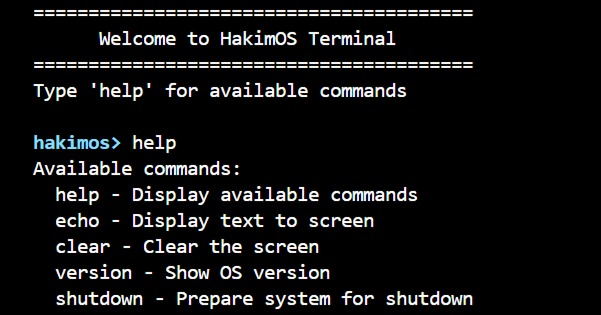

**What This Shows:**  
The help command displays all available commands with descriptions.

**Help Command Snippet:**
```c
/**
 * TASK 3 REQUIREMENT: help command
 * Display all available commands with their descriptions
 * This helps users discover what the terminal can do
 */
static void cmd_help(char *args)
{
    (void)args; // Suppress "unused parameter" warning (help doesn't use args)
    
    println_colored("Available commands:", TERM_COLOR_INFO);
    
    // Loop through command table until we hit the sentinel (NULL entry)
    for (int i = 0; commands[i].name != 0; i++)
    {
        print("  ");                      // Indent for readability
        print_colored(commands[i].name, TERM_COLOR_SUCCESS);  // Command name in green
        print(" - ");                     // Separator
        println(commands[i].description); // Print what it does
    }
}
```

### Version Command

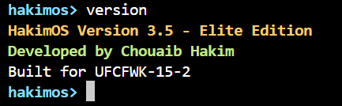

**What This Shows:**  
The version command displays OS information.

**Version Command Snippet:**
```c
static void cmd_version(char *args)                    // Implementation of 'version' command
{
    (void)args;                                        // Suppress unused parameter warning
    
    println_colored("HakimOS Version 3.5 - Elite Edition", TERM_COLOR_INFO);    // Print OS name/version in yellow
    println_colored("Developed by Chouaib Hakim", TERM_COLOR_SUCCESS);          // Print developer name in green
    println("Built for UFCFWK-15-2");                  // Print module code in default white
}
```

### Echo Command

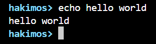

**What This Shows:**  
The echo command displays the provided text arguments.

**Echo Command Snippet:**
```c
/**
 * TASK 3 REQUIREMENT: echo command
 * Display the provided text (arguments) to screen
 * Example: "echo hello world" prints "hello world"
 */
static void cmd_echo(char *args)
{
    // Check if we have arguments (args is NULL if no arguments provided)
    if (args && *args)  // args exists AND first char isn't null terminator
    {
        println(args);  // Print whatever the user typed after "echo"
    }
    else
    {
        // No arguments - just print a blank line (like Unix echo)
        fb_put_char('\n');
    }
}
```

### Clear Command

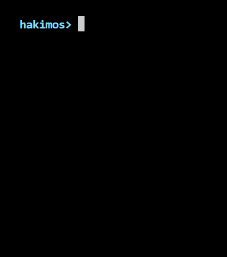

**What This Shows:**  
The clear command clears the screen.

**Clear Command Snippet:**
```c
/**
 * TASK 3 REQUIREMENT: clear command
 * Clear the screen (like Unix 'clear' command)
 */
static void cmd_clear(char *args)
{
    (void)args; // Suppress warning - clear doesn't need arguments
    fb_clear(); // Call framebuffer function to clear screen
}
```

### Shutdown Command

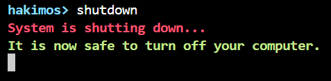

**What This Shows:**  
The shutdown command displays a message and halts the system.

**Shutdown Command Snippet:**
```c
/**
 * TASK 3 REQUIREMENT: shutdown command
 * Prepare system for shutdown and halt the CPU
 * In a real OS, this would close files, sync disks, etc.
 */
static void cmd_shutdown(char *args)
{
    (void)args; // Suppress warning - shutdown doesn't need arguments
    
    // Display shutdown message to user in red (warning color)
    println_colored("System is shutting down...", TERM_COLOR_ERROR);
    println_colored("It is now safe to turn off your computer.", TERM_COLOR_SUCCESS);
    
    // Halt the system permanently
    while (1)
    {
        // cli = disable interrupts, hlt = halt CPU
        // CPU will stay halted until hardware reset
        __asm__ volatile("cli; hlt");
    }
}
```

***

## Extension 1: Command History

**Objective:**  
Implement command history that allows users to navigate through previously entered commands using the up and down arrow keys, similar to bash and other Unix shells.

### History Buffer Structure

**Implementation (`terminal.c`):**
```c
// ===== EXTENSION 1: COMMAND HISTORY =====
// Store previously executed commands for recall with up/down arrows
#define HISTORY_SIZE 10  // Number of commands to remember

// History buffer - stores last HISTORY_SIZE commands
static char history[HISTORY_SIZE][MAX_COMMAND_LENGTH];
static int history_count = 0;      // Number of commands in history
static int history_index = 0;      // Current position when browsing history

/**
 * EXTENSION 1: Add command to history buffer
 * Stores command in circular buffer, oldest commands are overwritten
 */
static void history_add(const char *cmd)
{
    // Don't add empty commands to history
    if (!cmd || !*cmd)
        return;
    
    // Copy command to history buffer at current index
    int idx = history_count % HISTORY_SIZE;
    int i;
    for (i = 0; i < MAX_COMMAND_LENGTH - 1 && cmd[i]; i++)
    {
        history[idx][i] = cmd[i];
    }
    history[idx][i] = '\0';
    
    // Increment count (wraps around after HISTORY_SIZE)
    history_count++;
    
    // Reset browse index to end (most recent)
    history_index = history_count;
}
```

**Explanation:**  
The history buffer stores the last 10 commands in a circular buffer. When a new command is added, it's placed at the current index (modulo HISTORY_SIZE), effectively overwriting the oldest command when the buffer is full. The history_index tracks the current position when browsing, and is reset to the end (most recent) after each command execution.

### Arrow Key Handling

**Up Arrow Implementation:**
```c
// Handle up arrow - go back in history (older commands)
if (c == KEY_UP_ARROW)
{
    if (history_index > 0 && history_count > 0)
    {
        history_index--;
        
        // Clear current line on screen
        for (int i = 0; i < pos; i++)
        {
            fb_put_char('\b');
        }
        
        // Copy history entry to buffer
        int hist_idx = history_index % HISTORY_SIZE;
        pos = 0;
        while (history[hist_idx][pos] && pos < size - 1)
        {
            buf[pos] = history[hist_idx][pos];
            fb_put_char(buf[pos]);
            pos++;
        }
    }
    continue;
}
```

**Explanation:**  
When the up arrow is pressed, the code checks if there are older commands available. It then clears the current line by sending backspaces, decrements the history index to go back in time, and displays the older command by copying it from the history buffer to the input buffer while also echoing it to the screen.

### Command History in Action

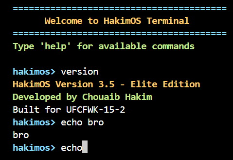

**What This Shows:**  
Pressing the up arrow recalls previously entered commands, allowing the user to re-execute or edit them.

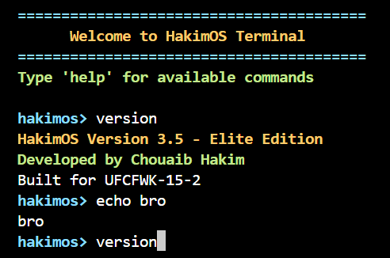

**What This Shows:**  
Demonstration of navigating backward and forward through command history using arrow keys.

***

## Extension 2: Tab Completion

**Objective:**  
Implement tab completion that auto-completes command names when the user presses Tab. If multiple commands match, display all possibilities.

### Tab Completion Logic

**Implementation (`terminal.c`):**
```c
static int tab_complete(char *buf, s32int *pos, s32int size)  // Auto-complete command on Tab press
{                                                       // buf = input buffer, pos = current position, size = buffer size
    int match_count = 0;                                // Counter for how many commands match
    int last_match = -1;                                // Index of last matching command (used if only 1 match)
    char *partial = buf;                                // Pointer to partial input (what user typed so far)
    int partial_len = *pos;                             // Length of partial input (dereference pos pointer)
    
    if (partial_len == 0)                               // Check if user hasn't typed anything yet
        return 0;                                       // Can't complete nothing, return failure
    
    // Find all matching commands
    for (int i = 0; commands[i].name != 0; i++)         // Loop through command table until sentinel (NULL)
    {
        int match = 1;                                  // Assume this command matches (innocent until proven guilty)
        for (int j = 0; j < partial_len; j++)           // Compare each character of partial input
        {
            if (commands[i].name[j] != partial[j])      // If any character doesn't match
            {
                match = 0;                              // This command doesn't match
                break;                                  // Stop comparing, move to next command
            }
        }
        if (match)                                      // If all characters matched
        {
            match_count++;                              // Increment match counter
            last_match = i;                             // Remember this command's index
        }                                               // If multiple matches, last_match keeps updating
    }
    
    // No matches
    if (match_count == 0)                               // Check if no commands matched
    {
        return 0;                                       // Return failure - nothing to complete
    }
    
    // Exactly one match - complete it
    if (match_count == 1)                               // If we found exactly one matching command
    {
        const char *cmd_name = commands[last_match].name;  // Get pointer to the full command name
        int cmd_len = strlen(cmd_name);                 // Calculate length of complete command
        
        // Clear and rewrite
        for (int i = 0; i < *pos; i++)                  // Loop through each character currently typed
            fb_put_char('\b');                          // Send backspace to erase partial input from screen
        
        for (int i = 0; i < cmd_len && i < size - 1; i++)  // Write complete command name
        {                                               // Check both command length and buffer size limit
            buf[i] = cmd_name[i];                       // Copy character to input buffer
            fb_put_char(cmd_name[i]);                   // Echo character to screen
        }
        *pos = cmd_len;                                 // Update position to end of completed command
        
        // Add space after completion
        if (*pos < size - 1)                            // Check if there's room for one more character
        {
            buf[*pos] = ' ';                            // Add space to buffer after command name
            fb_put_char(' ');                           // Display space on screen
            (*pos)++;                                   // Increment position past the space
        }                                               // Now user can immediately type arguments
        
        return 1;                                       // Return success (1 = completion happened)
    }
    
    // Multiple matches - show all possibilities
    fb_put_char('\n');                                  // Start new line for displaying matches
    for (int i = 0; commands[i].name != 0; i++)         // Loop through all commands again
    {
        int match = 1;                                  // Check if this command matches
        for (int j = 0; j < partial_len; j++)           // Compare characters
        {
            if (commands[i].name[j] != partial[j])      // If doesn't match
            {
                match = 0;                              // Mark as no match
                break;                                  // Stop checking
            }
        }
        if (match)                                      // If this command matched
        {
            print("  ");                                // Indent each matching command
            println_colored(commands[i].name, TERM_COLOR_SUCCESS);  // Display in green
        }
    }
    
    // Redisplay prompt and partial command
    print_colored("hakimos> ", TERM_COLOR_PROMPT);     // Redisplay the prompt
    for (int i = 0; i < *pos; i++)                      // Redisplay what user already typed
    {
        fb_put_char(buf[i]);                            // Echo each character back
    }
    
    return 1;                                           // Return success (displayed matches)
}
```

**Explanation:**  
The tab completion function searches through the command table to find all commands that start with the partial input. It compares each character of the user's input against each command name, counting how many match. If exactly one match is found, it clears the partial text by sending backspaces, writes the complete command name character by character, and adds a space for convenience so the user can immediately type arguments. If multiple matches exist, the function displays all matching commands in green on new lines, then redisplays the prompt and the user's partial input, allowing them to continue typing to narrow down the choices. If no matches exist, it returns without doing anything.

### Single Match Completion


**What This Shows:**  
Tab completion automatically completes "he" to "help " with a single Tab press when only one command matches.

**Tab Key Detection Snippet:**
```c
if (c == KEY_TAB)                                      // Check if user pressed Tab key (0x09)
{
    tab_complete(buf, &pos, size);                     // Call tab completion function with current buffer state
    continue;                                          // Skip rest of loop, wait for next key
}                                                      // Tab is never added to buffer as a character
```

### Multiple Match Display

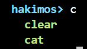

**What This Shows:**  
When multiple commands match the partial input, Tab displays all matching possibilities to help the user choose.

***

## Extension 3: Color Support

**Objective:**  
Add color support to the terminal for better visual experience with colored prompts, success messages, error indicators, and informational text.

### Color System

**Color Definitions (`terminal.c`):**
```c
// VGA color codes
#define COLOR_BLACK 0                                  // Standard VGA color palette value for black
#define COLOR_BLUE 1                                   // Dark blue
#define COLOR_GREEN 2                                  // Dark green
#define COLOR_CYAN 3                                   // Dark cyan (blue-green)
#define COLOR_RED 4                                    // Dark red
#define COLOR_MAGENTA 5                                // Dark magenta (purple)
#define COLOR_BROWN 6                                  // Brown/dark yellow
#define COLOR_LIGHT_GREY 7                             // Default text color in most terminals
#define COLOR_DARK_GREY 8                              // Dim grey (half brightness)
#define COLOR_LIGHT_BLUE 9                             // Bright blue
#define COLOR_LIGHT_GREEN 10                           // Bright green
#define COLOR_LIGHT_CYAN 11                            // Bright cyan
#define COLOR_LIGHT_RED 12                             // Bright red (used for errors)
#define COLOR_LIGHT_MAGENTA 13                         // Bright magenta/pink
#define COLOR_YELLOW 14                                // Bright yellow (high visibility)
#define COLOR_WHITE 15                                 // Pure white (maximum brightness)

// Terminal color scheme                              // Semantic mapping for terminal UI elements
#define TERM_COLOR_PROMPT COLOR_LIGHT_CYAN             // Prompt text color (stands out from normal text)
#define TERM_COLOR_NORMAL COLOR_LIGHT_GREY             // Default text color for output
#define TERM_COLOR_ERROR COLOR_LIGHT_RED               // Error messages (high visibility red)
#define TERM_COLOR_SUCCESS COLOR_LIGHT_GREEN           // Success/confirmation messages
#define TERM_COLOR_INFO COLOR_YELLOW                   // Informational messages (headers, tips)
#define TERM_COLOR_BG COLOR_BLACK                      // Background color for all text
#define TERM_COLOR_YELLOW COLOR_YELLOW                 // Alias for yellow (used in welcome banner)
#define TERM_COLOR_LIGHT_CYAN COLOR_LIGHT_CYAN         // Alias for light cyan (used in banner borders)
```

**Explanation:**  
The color system uses standard VGA color codes (0-15) for 16 basic colors. I defined semantic color names for different terminal elements: cyan for prompts, light grey for normal text, red for errors, green for success messages, and yellow for informational text. This makes the code more readable and maintainable.

### Colored Output Functions

**Colored Output Functions:**
```c
static void print_colored(const char *str, u8int color)  // Print string in specified color
{
    fb_set_color(color, TERM_COLOR_BG);                // Set foreground to specified color, background black
    print(str);                                        // Print the string using current color
    fb_set_color(TERM_COLOR_NORMAL, TERM_COLOR_BG);   // Restore default light grey color after printing
}                                                      // Prevents color "bleeding" to subsequent text

static void println_colored(const char *str, u8int color)  // Print string in color with newline
{
    fb_set_color(color, TERM_COLOR_BG);                // Set foreground color, background stays black
    println(str);                                      // Print string followed by newline
    fb_set_color(TERM_COLOR_NORMAL, TERM_COLOR_BG);   // Reset to default color after printing
}                                                      // Ensures next line starts with normal color
```

**Explanation:**  
These helper functions temporarily change the color, print the text, and restore the default color. This prevents color "bleeding" where subsequent text would incorrectly inherit the color.

### Terminal with Colors


**What This Shows:**  
The complete color scheme in action with the cyan "hakimos>" prompt, colored command output, and various message types in their appropriate colors.

**Welcome Banner Snippet:**
```c
println_colored("========================================", TERM_COLOR_LIGHT_CYAN);  // Top border in cyan
println_colored("      Welcome to HakimOS Terminal", TERM_COLOR_YELLOW);           // Main title in yellow
println_colored("========================================", TERM_COLOR_LIGHT_CYAN);  // Bottom border in cyan
println_colored("Type 'help' for available commands", TERM_COLOR_SUCCESS);         // Hint in green
```

**What This Shows:**  
Error messages displayed in red for clear visual feedback when an invalid command is entered.

***

## Extension 4: Virtual File System

**Objective:**  
Create a basic simulated file system with commands to list files (ls), display file contents (cat), and show the current directory (pwd).

### Virtual File Structure

**VFS Implementation (`terminal.c`):**
```c
struct virtual_file {
    const char *name;
    const char *type;
    const char *content;
};

// Virtual file system - simulated files stored in memory
static struct virtual_file vfs[] = {                   // Static array holding all "files" in RAM
    {"readme.txt", "document", "Welcome to HakimOS!\nThis is a simulated file system.\nType 'help' for available commands.\n"},  // First file
    {"boot.cfg", "config", "kernel=kernel.bin\nmemory=128MB\nboot_timeout=5\n"},  // Config file
    {"system.log", "log", "[BOOT] HakimOS starting...\n[INFO] Framebuffer initialized\n[INFO] Interrupts enabled\n[INFO] Terminal ready\n"},  // Log file
    {"kernel.bin", "binary", "[Binary data - cannot display]\n"},  // Binary file (placeholder content)
    {"version.txt", "document", "HakimOS Version 3.5 - Elite Edition\nBuild Date: December 2025\n"},  // Version info
    {0, 0, 0}  // Sentinel                            // NULL entry marks end of array for iteration
};
```

**Explanation:**  
The virtual file system is an array of structures stored in memory, where each structure represents a file with a name, type, and content. This simulates a file system without needing actual disk I/O. The sentinel value (all NULLs) marks the end of the file list.

### ls Command

**Implementation:**
```c
static void cmd_ls(char *args)                         // List all files in VFS (like Unix 'ls')
{
    (void)args;                                        // Ignore arguments (VFS has no subdirectories)
    
    println_colored("Files in /:", TERM_COLOR_INFO);   // Print header in yellow
    
    for (int i = 0; vfs[i].name != 0; i++)             // Loop through VFS array until sentinel
    {
        print("  ");                                   // Indent each filename
        print_colored(vfs[i].name, TERM_COLOR_SUCCESS);  // Print filename in green
        
        // Add spacing                                 // Format: align file types in a column
        int padding = 20 - strlen(vfs[i].name);        // Calculate spaces needed for alignment
        for (int j = 0; j < padding && j < 20; j++)    // Add spaces to align type column
        {
            fb_put_char(' ');                          // Print one space at a time
        }
        
        print("[");                                    // Opening bracket for type field
        print(vfs[i].type);                            // Print file type (document/config/log/binary)
        println("]");                                  // Closing bracket and newline
    }
}
```

**Explanation:**  
The ls command iterates through the VFS array, displaying each file's name in green and its type in brackets. Padding is added to align the file types in columns for better readability.

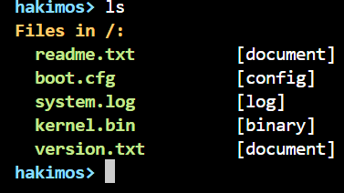

**What This Shows:**  
The ls command displays all files in the simulated file system with proper formatting and color.

### cat Command

**Implementation:**
```c
static void cmd_cat(char *args)                        // Display file contents (like Unix 'cat')
{
    if (!args || !*args)                               // Check if filename argument was provided
    {
        println_colored("Usage: cat <filename>", TERM_COLOR_ERROR);  // Show usage in red
        println("Example: cat readme.txt");            // Give example in default color
        return;                                        // Exit early if no argument
    }
    
    for (int i = 0; vfs[i].name != 0; i++)             // Search through VFS array
    {
        if (strcmp(args, vfs[i].name) == 0)            // Compare filename argument with each VFS entry
        {
            print(vfs[i].content);                     // Print file contents if match found
            return;                                    // Exit after displaying (file found)
        }
    }
    
    // If we reach here, file was not found           // Loop completed without finding file
    print_colored("cat: ", TERM_COLOR_ERROR);          // Print "cat: " prefix in red
    print(args);                                       // Print the filename that wasn't found
    println(": No such file");                         // Complete error message
    println_colored("Use 'ls' to see available files", TERM_COLOR_INFO);  // Helpful suggestion in yellow
}
```

**Explanation:**  
The cat command takes a filename as an argument, searches the VFS for a matching file, and displays its contents if found. If the file doesn't exist, it shows a helpful error message suggesting to use ls to see available files.

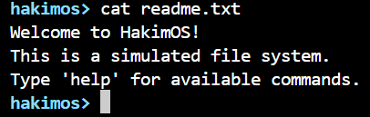

**What This Shows:**  
The cat command successfully displays the contents of a file from the virtual file system.

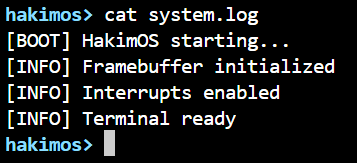

**What This Shows:**  
Viewing another file to demonstrate the file system contains multiple files with different content.

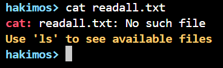

**What This Shows:**  
When attempting to cat a file that doesn't exist, the terminal displays a helpful error message in red and suggests using 'ls' to see available files.

### pwd Command

**Implementation:**
```c
static void cmd_pwd(char *args)                        // Print working directory (like Unix 'pwd')
{
    (void)args;                                        // Ignore any arguments
    println("/");                                      // Always print root "/" since no subdirectories exist
}                                                      // In real OS, would track current_directory global variable
```

**Explanation:**  
The pwd (print working directory) command simply displays "/" since this simple file system has only a single root directory. In a more complex implementation, this would track the current directory as the user navigates.

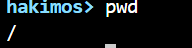

**What This Shows:**  
The pwd command displays the current working directory (root in this case).
